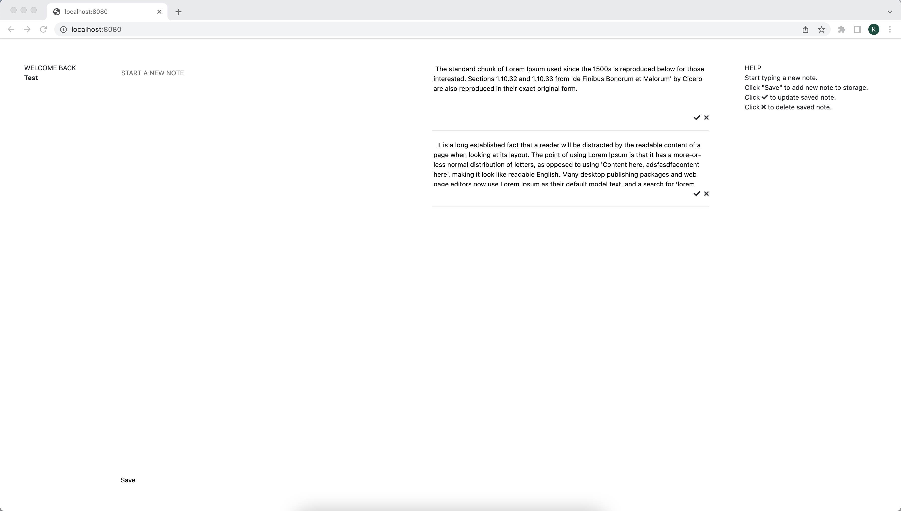

# Notes

This project sets up a local server and uses a basic login to allow a user to write, store, edit and delete text notes.

## Installation
1. Open CLI
2. Clone the repo
3. ```cd``` into cloned repo
4. Execute: ```npm install```
5. Execute: ```node app.js```
6. Open "localhost:8080" in browser

## Help
- Click to start typing a new note
- "Save" to add note to storage
- Click the tick to update saved notes
- Click the cross to delete saved note
